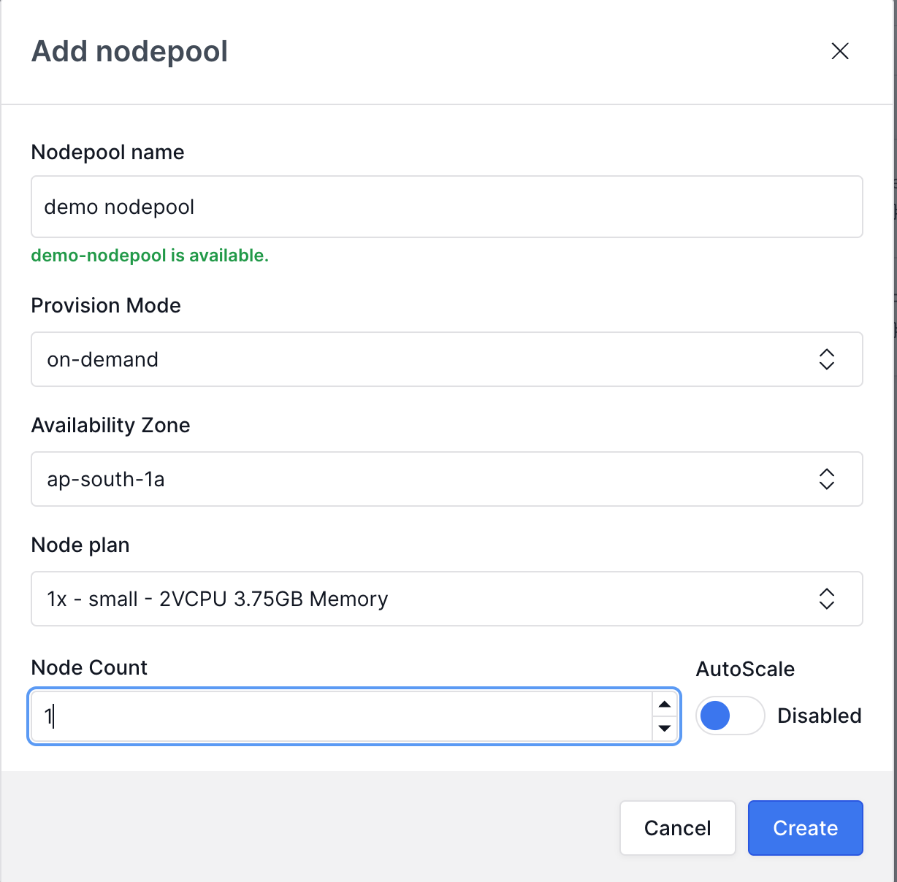

# Add your Cloud Provider

You can setup your cloud provider while creating your account.&#x20;

If you already have an existing kloudlite account you can create cloud providers from dashboard&#x20;

`Dashboard > Settings > Cloud Providers`

**Step-by-Step Guide to setup your cloud provider.**



### **Create a New Cloud Provider**:

<figure><figcaption></figcaption></figure>

* Give relevant name to cloud provider
* Choose 'Amazon Web Services' and enter your Account ID and **proceed** to generate cloudformation stack URL.

### **Create CloudFormation Stack**

<figure><figcaption>
Open the URL generated to create cloud formation stack in your AWS account.
</figcaption></figure>

* Copy the provided URL for cloud-formation stack creation.
* Open this URL in a browser where you are already logged into your AWS account/sub-account.
* Proceed with the CloudFormation stack creation steps as guided.

<mark style="color:orange;background-color:yellow;">**Note:**</mark> <mark style="color:orange;background-color:yellow;"></mark><mark style="color:orange;background-color:yellow;">If you want to use Kloudlite with less expansive permissions than what is provisioned by the CloudFormation stack, please</mark> [<mark style="color:orange;background-color:yellow;">contact us</mark>](https://cal.com/talk-to-porter/15min) <mark style="color:orange;background-color:yellow;">to inquire about Kloudlite Enterprise. In Kloudlite Enterprise we can customise the scope based on your requirements. You can explore all other benefits of Kloudlite Enterprise from here.</mark>

### **Verification**

* Once the stack installation is complete, Kloudlite will gain access to your AWS account.
* Verify this connection in your Kloudlite dashboard to ensure everything is set up correctly.



### **Enable GCP APIs**

<figure><figcaption></figcaption></figure>

To use Kloudlite on GCP, you must first enable some APIs on your project.

* Navigate to the **APIs & Services** tab of your project.
* Click on the **Enable APIs and Services** button at the top. This will bring up a catalog of APIs that you can enable on GCP. Enable the following APIs:
  * Compute Engine API
  * Cloud Resource Manager API

It might take a few minutes for each of these APIs to be enabled. Once you can confirm that all five APIs are enabled from the **APIs & Services** tab, proceed to the next section.

### Create Service Account

First, go to your [Google Cloud console](https://console.cloud.google.com/) and navigate to **IAM & Admin** -> **Service Accounts**

<figure><figcaption></figcaption></figure>

Select Create Service Account

<figure><figcaption></figcaption></figure>

After naming your service account, grant the service account these three permissions:

1. **Cloud Storage > Storage Admin**
2. **Compute Engine > Compute Admin**
3. **Service Accounts > Service Account User**

Select **Done** to create the service account.

### Generate Access Keys

Once the service account has been created, under **Actions** select **Manage keys**.

<figure><figcaption></figcaption></figure>

Select **ADD KEY** -> **Create new key** and then choose **JSON** as your key type. After creation, your JSON key will automatically be downloaded as a file. You will need this key later.

<figure><figcaption></figcaption></figure>

### Create Cloud Provider

<figure><figcaption></figcaption></figure>

* Give relevant name to cloud provider
* Choose 'Google Cloud Provider' & Upload the generated key and **proceed**
* Validate your key and proceed



Will be available soon!



Feel free to suggest your favourite providers!! Drop your suggestions [here](https://github.com/orgs/kloudlite/discussions/categories/ideas)!



With your cloud provider creation completed, you are now ready to [create your first cluster](create-your-first-cluster.md) using Kloudlite!
