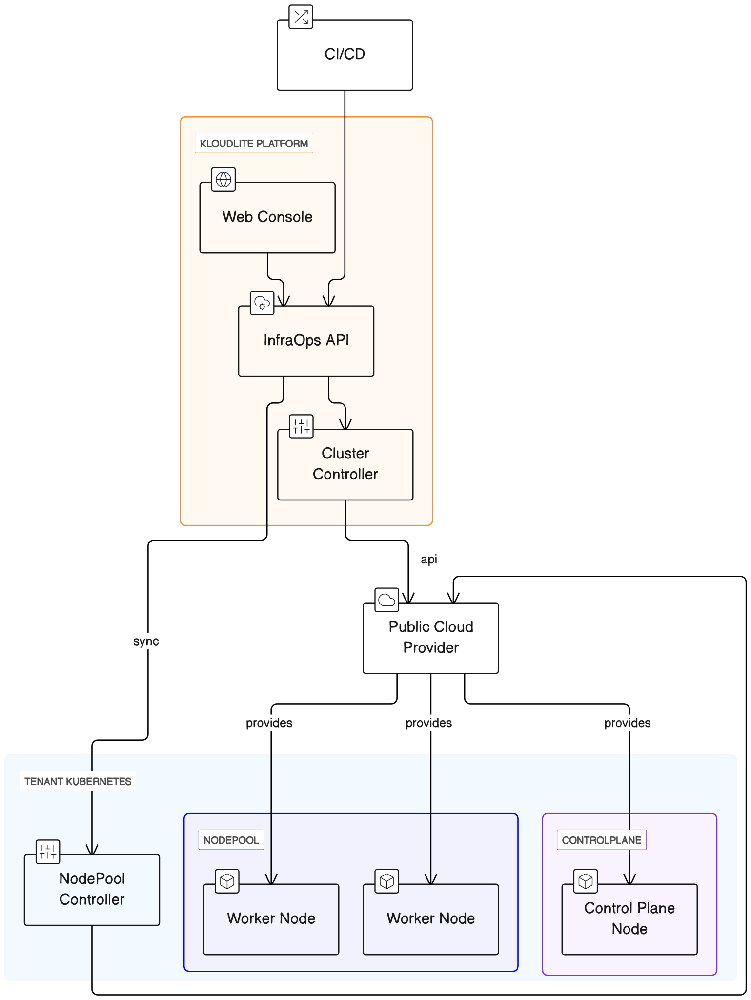

# How Kloudlite InfraOps works ?

**Overview of InfraOps Module**

The InfraOps module is a core component of the Kloudlite platform, designed to facilitate efficient Kubernetes cluster management. This module primarily consists of **Cluster Controllers** which play a crucial role in interfacing with various cloud providers.

#### Cluster Controllers: Creating and Managing Instances

* **Communication with Cloud Providers**: The cluster controllers are engineered to communicate effectively with different cloud providers. This communication is key to orchestrating and managing cloud resources.
* **Creating Linux Instances**: These controllers have the capability to create Linux instances across desired regions. This feature allows for a high degree of flexibility and scalability, adapting to the geographical and computational needs of different projects.
* **Forming Kubernetes Clusters**: Once instances are created, the controllers proceed to join these instances, culminating in the formation of a fully operational Kubernetes cluster.

#### NodePool Controller: Enhancing Cluster Efficiency

* **Located in Tenant Clusters**: The NodePool controller operates within the tenant clusters created by the InfraOps module.
* **Managing NodePools**: This controller is responsible for a range of critical tasks, including the creation, scaling up, and scaling down of NodePools. These operations are essential for maintaining the efficiency and responsiveness of the Kubernetes clusters.
* **Integration with Autoscalers and Deschedulers**: To optimize costs and improve the distribution of workloads, the NodePool controllers are backed by advanced tools such as cluster autoscalers and deschedulers. These tools ensure that resources are utilized optimally, reducing waste and enhancing performance.

#### Handling Spot Instance Replacements

* **Graceful Management of Interruptions**: A key feature of the NodePools is their ability to handle spot instance replacements gracefully. This involves managing node interruptions efficiently to maintain the stability and reliability of the clusters.

Here is the architecture diagram showing how Kloudlite InfraOps works

<figure><figcaption></figcaption></figure>
