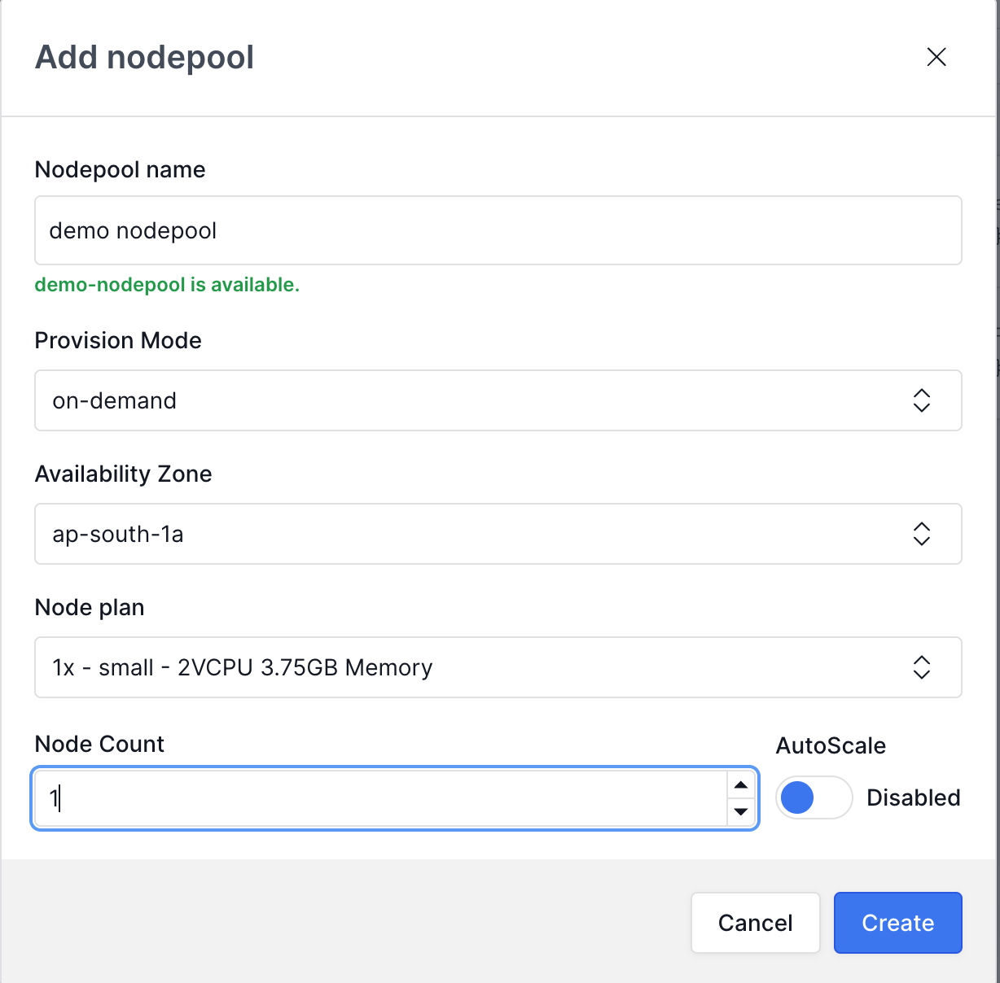

# Setup NodePools



If you already have an existing kloudlite account and AWS cluster you can create nodepools from dashboard&#x20;

`Dashboard > Infrastructure > Clusters > Nodepools`

<figure><figcaption></figcaption></figure>

* **Select Nodepool Type**
  * **On-Demand**: Ideal for stateful workloads.
  * **Spot**: Cost-effective for stateless workloads.
* **Choose Instance Size**
  * Select the size of the instances for the node pool.
* **Configure Pool Size Limits**
  * Set minimum and maximum limits for your node pool.
* **Create Your Node-Pool**
  * Submit to create your node pool.
  * Your cluster is now ready for workloads!



If you already have an existing kloudlite account and GCP cluster you can create nodepools from dashboard&#x20;

`Dashboard > Infrastructure > Clusters > Nodepools`

<figure><figcaption></figcaption></figure>

* **Select Nodepool Type**
  * **Standard**: Ideal for stateful workloads.
  * **Spot**: Cost-effective for stateless workloads.
* **Choose Machine type**
  * Enter machine type for the node pool.
* **Configure Pool Size Limits**
  * Set minimum and maximum limits for your node pool.
* **Create Your Node-Pool**
  * Submit to create your node pool.
  * Your cluster is now ready for workloads!



Will be available soon!



