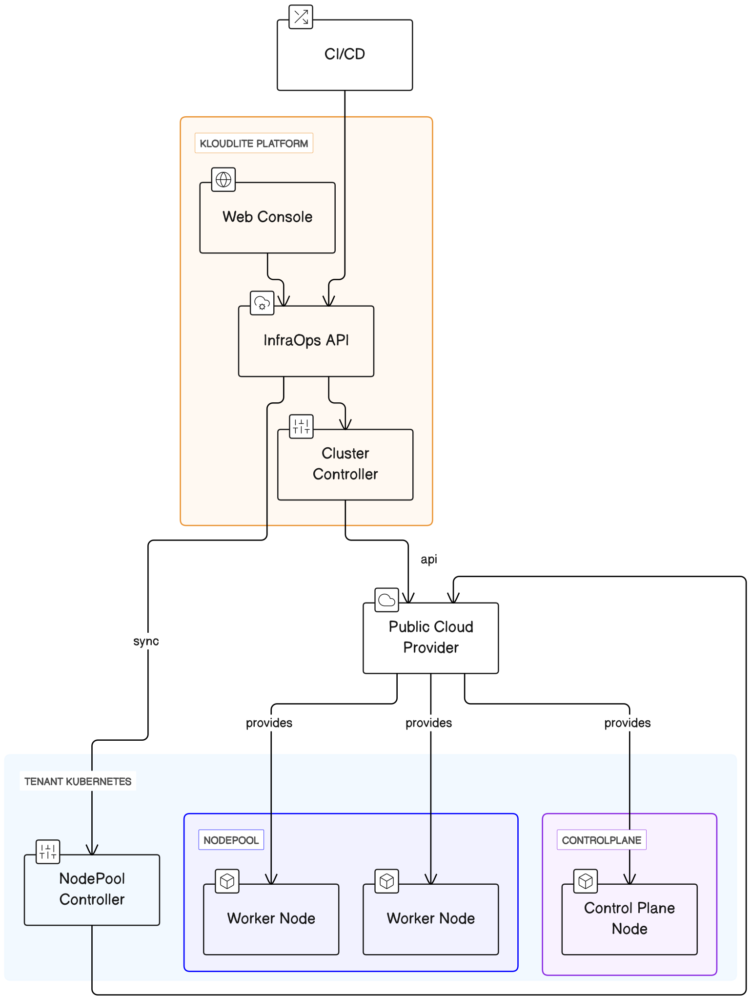

# How Kloudlite InfraOps works ?

## **Overview of the InfraOps Module**

The InfraOps module serves as a fundamental element of the Kloudlite platform, aiming to streamline Kubernetes cluster management. At the heart of this module are Cluster Controllers, which are instrumental in interfacing with various cloud providers to manage cloud resources and Kubernetes clusters.

## **Cluster Controllers**

**Operations and Functions**

* **Communication with Cloud Providers:** Cluster controllers are designed to interface with cloud providers, orchestrating cloud resources through direct communication channels.
* **Creation of Linux Instances:** These controllers possess the capability to instantiate Linux environments across multiple regions, offering scalability and adaptability for project requirements based on geographical and computational demands.
* **Formation of Kubernetes Clusters:** Following the instantiation of Linux environments, these controllers join the instances to establish fully functional Kubernetes clusters.

### **NodePool Controller**

**Efficiency and Scalability**

* **Operation within Tenant Clusters:** The NodePool controller is embedded within tenant clusters generated by the InfraOps module, focusing on enhancing cluster efficiency.
* **Management of NodePools:** Key responsibilities include creating, scaling up, and scaling down NodePools, crucial for maintaining optimal performance and responsiveness of Kubernetes clusters.
* **Integration with Autoscalers and Deschedulers:** To further refine cost efficiency and workload distribution, NodePool controllers utilize autoscalers and deschedulers. These tools are pivotal in optimizing resource allocation, minimizing waste, and boosting cluster performance.

### **Management of Spot Instance Replacements**

* **Efficient Handling of Interruptions:** An essential capability of NodePools is their adeptness at managing spot instance replacements and interruptions. This ensures clusters remain stable and reliable, even in the face of potential disruptions.

This documentation outlines the operational framework and key components of the Kloudlite InfraOps module, highlighting its role in facilitating effective Kubernetes cluster management through advanced communication, instantiation, and optimization mechanisms.

Here is the architecture diagram showing how Kloudlite InfraOps works

<figure><figcaption></figcaption></figure>
